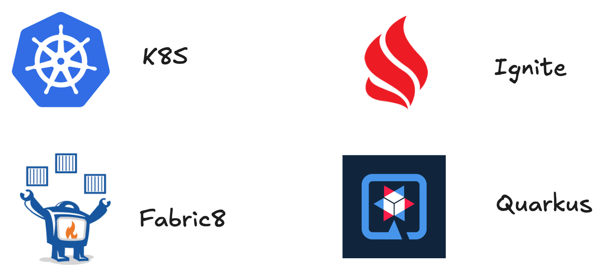

== High-Performance Distributed File Processing

ajouter l'image qui zoom sur la partie ignite (2a)

=== Stack Technique

* *Kubernetes* : Orchestrates and dynamically creates pods
* *Fabric API* : Triggers pod creation based on the file size
* *Apache Ignite* : In-memory distributed storage for file lines
* *Java Quarkus* : Lightweight JVM application in each pod, fast startup
* *COS / S3* : Source of the files to be processed

[%notitle]
=== Architecture

[.notes]
--
* tell anecdote
* make a point
--

