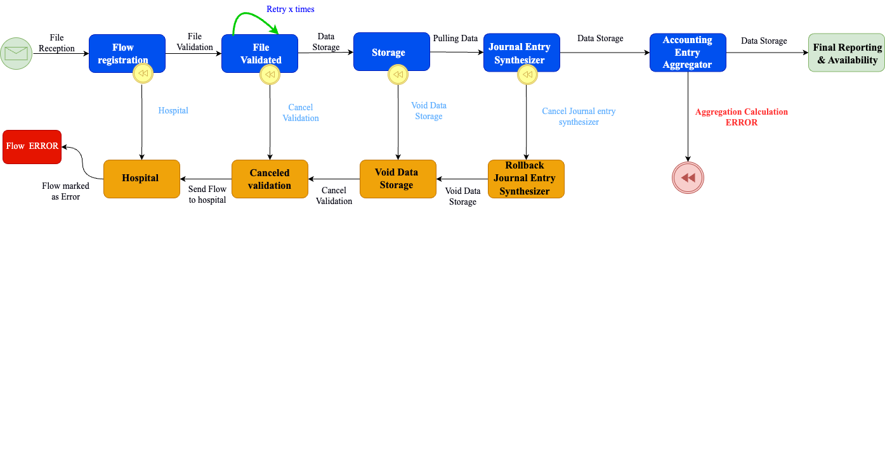

== Orchestration

=== Orchestration

image::Ingestion_big_picture.png[width="85%"]

=== Workflow Technologies

[%notitle]
=== Grand Announcement

=== Cooking Pizza Workflow

=== Cooking Pizza Workflow

=== Cooking Pizza Workflow

[source,subs="verbatim,quotes"]
----
public class Pizzeria {
    ...
    public Pizza cookingPizza(int numberOfPizzas, int time) {
        //Make pizza dough
        var dough = beaterService.makePizzaDough(numberOfPizzas);
        //Roll out the dough and top
        var rollOutTop = rollOutService(dough);
        //Bake the pizza
        var pizza = ovenService.bake(rollOutTop,time);
        // Cut pizza
        pizza = ovenService.cut(pizza);
        return pizza;
    }
}
----

=== Accounting Calculation Workflow

=== Accounting Calculation Workflow

[transition=zoom]
=== Accounting Calculation Workflow

[transition=zoom]
=== BPMN 2.0

[transition-speed=fast]
=== BPMN 2.0

[transition=zoom]
=== Kogito

=== Kogito

[.column]
*Next-gen Cloud native Business Automation*

[%step]
=== icon:lightbulb-o[lg] Cogito ergo sum

[.quote]
Cloud native Business Automation for building Intelligent applications backed by battle-tested capabilities

[.column]

=== Traditional platform BPMN

[%step]
* icon:box[1x] A large monolith and Stateful
* icon:project-diagram[1x] Not Optimized for cloud and architecture microservices.
* icon:clock[1x] Long startup time
* icon:microchip[1x] Large compute consumption
* icon:tachometer[1x] Poor performance
* icon:user-cog[1x] Affect developers productivity

=== WHY KOGITO

[cols="1a,1a"]
|===
|
* icon:cloud[1x] *Cloud first priority*
* icon:layer-group[1x] *Optimized for cloud architecture*
* icon:gears[1x] *Multi runtime mode*
* icon:microchip[1x] *Technology Enabler*
* icon:code[1x] *Developer-centric Experience*
| image::../../resources/images/kogito/kogito_2.png[width="900"]
|===

=== TOOLING

[transition=zoom]
=== DEMO

[transition=zoom]
=== Order Shipment Workflow

=== Order Shipment Workflow BPMN 2.0

=== What you need for your first workflow

=== CODE GENERATION

[%step]
[.text-center.small]
Traditional Pipeline

[%step]

[%step]
[.text-center.small]
Kogito Pipeline

[%step]
[.image-center]

=== Challenges of Microservice Architecture

[cols="1a,1a"]
|===
|
* *Observability*
* *Scalability*
* *Easy to use / evolve*
* *High availability*
* *Schedules*
* *Human operation friendly*
|
* *Fault-Tolerance(Retry)*
* *Atomicity*
* *Data Consistency (Saga)*
* *Long Running Friendly*

|===
