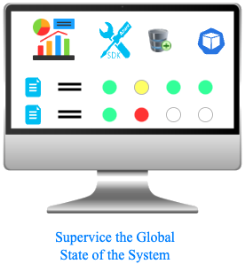
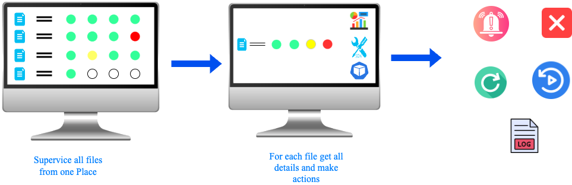
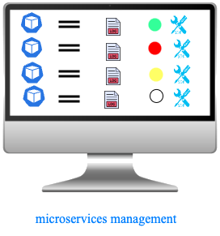

##== Monitoring Visor

== Monitoring and Observation UI

=== Global Dashboard View

[%step]
* icon:clock-o[] Real-time global system overview
* icon:pie-chart[] Statistics on incoming flows: total, in-progress, completed, failed
* icon:eye[] Supervise microservices and database health
* icon:user-cog[1x] Trigger corrective actions directly

=== Flow Details

[%step]
* icon:clock-o[] Filter flows by topology
* icon:clock-o[] Track step-by-step flow execution
* icon:clock-o[] Access step-level logs
* icon:clock-o[] Available actions:
- Restart (from beginning or specific step)
- Cancel
- Temporarily disable a flow type

=== Microservices Management

* List all pods per microservice
* Real-time status visualization
* Available actions:
* Restart pod
* Manual stop

=== Key Benefits

* Centralized system supervision
* Faster incident response
* Fine-grained system observability
* Reduced reliance on external tools and CLI

